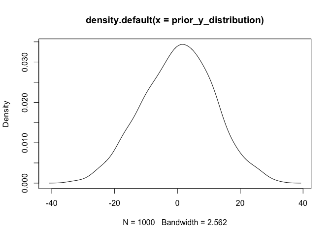

```r
knitr::opts_chunk$set(echo = TRUE)
library(tidyverse)
```

```
## ── Attaching packages ─────────────────────────────────────────────────────────── tidyverse 1.2.1 ──
```

```
## ✔ ggplot2 3.1.0       ✔ purrr   0.3.2  
## ✔ tibble  2.1.1       ✔ dplyr   0.8.0.1
## ✔ tidyr   0.8.3       ✔ stringr 1.3.1  
## ✔ readr   1.3.1       ✔ forcats 0.4.0
```

```
## Warning: package 'tibble' was built under R version 3.5.2
```

```
## Warning: package 'tidyr' was built under R version 3.5.2
```

```
## Warning: package 'purrr' was built under R version 3.5.2
```

```
## Warning: package 'dplyr' was built under R version 3.5.2
```

```
## Warning: package 'forcats' was built under R version 3.5.2
```

```
## ── Conflicts ────────────────────────────────────────────────────────────── tidyverse_conflicts() ──
## ✖ dplyr::filter() masks stats::filter()
## ✖ dplyr::lag()    masks stats::lag()
```

```r
#library(rethinking)
```


#### 4E1 In the model definition below, which line is the likelihood?

$y_i \sim Normal(\mu, \sigma)$


#### 4E2 In the model definition just above, how many parameters are in the posterior distribution?

2, parameters $\mu$ and $\sigma$


#### 4E3 Using the model definition above, write down the appropriate form of Bayes’ theorem that
includes the proper likelihood and priors.

not sure but: $P(\mu , \sigma | y) = \frac{P(y_i \sim Normal(\mu, \sigma)) * P(\mu \sim Normal(0,10)) * P(\sigma \sim Uniform(0,10))}{P(prior\ probability\ of\ y)}$


#### 4E4. In the model definition below, which line is the linear model?

$ \mu _i ~ \alpha + \beta x_i$

#### 4E5. In the model definition just above, how many parameters are in the posterior distribution?

2, parameters $\alpha$ and $\beta$


##4M1. For the model definition below, simulate observed heights from the prior (not the posterior).


```r
# sample sigma from a uniform dist from 0, 10
sigma_s <- runif(1000, 0, 10)
mu_s <- rnorm(1000, 0, 10)

prior_y_distribution <- rnorm(1000, mean=mu_s, sd=sigma_s)
plot(density(prior_y_distribution))
```

<!-- -->

#### 4M2. Translate the model justabove into a quap formula

```r
flist <- alist(
    y ~ dnorm( mu_s, sigma_s ) ,
    mu ~ dnorm( 0 , 10 ) ,
    sigma ~ dunif( 0 , 10 )
)
```

#### 4M3. Translate the quap model formula below into a mathematical model definition.

flist <- alist(
    y ~ dnorm( mu , sigma ),
    mu <- a + b*x,
    a ~ dnorm( 0 , 50 ),
    b ~ dunif( 0 , 10 ),
    sigma ~ dunif( 0 , 50 )
)

$$

y_i \sim Normal( \mu, \sigma ) \\

\mu = \alpha + \beta xi \\

\alpha \sim Normal(0, 50) \\

\beta \sim Normal(0,10) \\

\sigma \sim Uniform(0, 50)

$$


